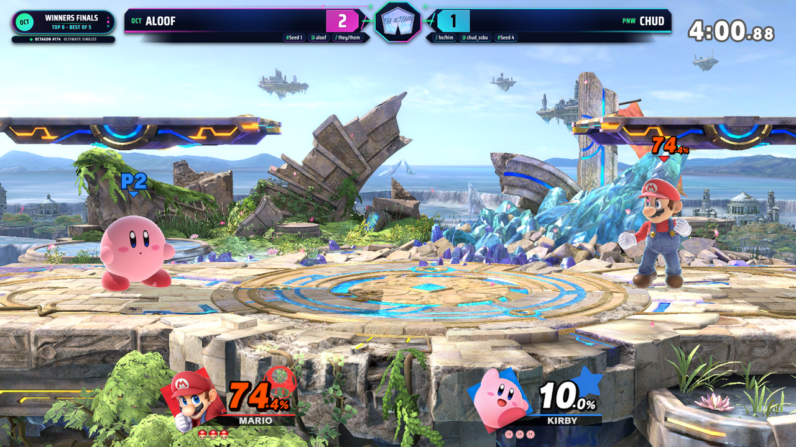
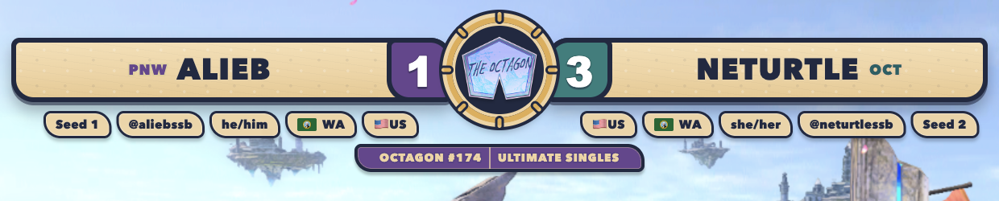

# TournamentStreamHelper

A Stream helper for fighting game tournaments!

## Setup and usage

https://github.com/joaorb64/TournamentStreamHelper/wiki

## Octagon overlay

The Octagon overlay is a dedicated 1920x1080 Super Smash Bros. Ultimate
scoreboard with a nautical broadcast identity. Warm canvas textures, brass
hardware, navy framing, and purple and teal player colors keep the presentation
themed without competing with gameplay.

Its compact score-first layout places player names, scores, seeds, handles,
pronouns, and regional flags around a central Octagon crest. A separate
captain's-log card carries the bracket phase and best-of context, preserving
vertical space for the game capture. New sets replay the full entrance
animation, while score updates use a focused ship-bell pulse, rolling numeral,
brass flash, and restrained particles. Reduced-motion preferences are supported,
and all visual assets are bundled locally for reliable OBS playback.

Use [`custom_layouts/scoreboard_octagon/index.html`](custom_layouts/scoreboard_octagon/index.html)
as the browser source.

### Overlay details

**Score-first player bars** — The event crest anchors the layout while metadata
chips keep tournament information readable at a glance.

**Captain's log** — Bracket phase and set format stay visible in a compact
themed card away from the central gameplay area.

## Application

## Donations

